# 🤖 MyAgent — قاعدة المعرفة الشاملة لدورة حياة تطوير البرمجيات (SDLC) و DevSecOps

[ 🇮🇩 Bahasa Indonesia ](README.md) | [ 🇬🇧 English ](README.en.md) | [ 🇨🇳 简体中文 ](README.zh.md) | [ 🇸🇦 العربية ](README.ar.md)

---

[-blue.svg)](#-معايير-اللغات-وواجهة-المستخدم-i18n--rtl)

> **MyAgent** هو مستودع متكامل لإجراءات التشغيل القياسية (SOPs)، وأفضل الممارسات التقنية، ووحدات المهارات المنظمة المصممة خصيصاً لـ **مساعدي البرمجة بالذكاء الاصطناعي** (Cursor, Claude Code, GitHub Copilot, Codex) و**فرق هندسة البرمجيات** لتنفيذ دورة حياة تطوير البرمجيات الكاملة (**SDLC**) المدفوعة بـ **DevSecOps** عبر جميع لغات البرمجة الرائدة.

---

## 🌍 دعم متعدد اللغات (Polyglot)

جميع وحدات المهارات مصممة لتكون **مستقلة عن اللغة (Language-Agnostic)** مع معايير نموذجية لأبرز بيئات التطوير:

| البيئة التقنية | أطر عمل الواجهة الخلفية / الأمامية | حزم الاختبار | أدوات التحليل والتنسيق | صورة الحاوية الأساسية |
|---|---|---|---|---|
| **TypeScript (Angular 17+ / React / Node)** | Angular 17+ (Signals), React, Next.js, Vue, NestJS | Vitest, Jest, Playwright | ESLint, Prettier, `@angular-eslint` | `node:20-alpine`, `nginx:alpine` |
| **Python** | FastAPI, Django REST, Flask | PyTest, Unittest | Ruff, Black, MyPy | `python:3.12-slim` |
| **Golang** | Gin, Fiber, Echo, gRPC | `go test`, Testify | `golangci-lint`, `gofmt` | `golang:alpine` ➔ `scratch` (<20MB) |
| **Java / Kotlin** | Spring Boot, Micronaut, Quarkus | JUnit 5, Mockito | Spotless, Checkstyle | `eclipse-temurin:21-jre-alpine` |
| **PHP** | Laravel, Symfony | Pest, PHPUnit | PHPStan, PHP-CS-Fixer | `php:8.3-fpm-alpine` + Nginx |
| **C# / .NET 10** | ASP.NET Core 10 Minimal API / Web API (Native AOT) | xUnit, NUnit | Roslyn, `dotnet format` | `mcr.microsoft.com/dotnet/aspnet:10.0` |
| **Rust** | Actix-web, Axum, Tonic (gRPC) | `cargo test` | Clippy, `rustfmt` | `rust:alpine` ➔ `scratch` (<15MB) |

---

## 🗺️ مسار العمل الشامل لدورة حياة البرمجيات (SDLC)

تنقسم وحدات المهارات إلى 4 مراحل هندسية متتالية:

```mermaid
flowchart LR
    subgraph S1["المرحلة 1: التخطيط والتأسيس"]
        direction TB
        P["01. التخطيط و PRD"] --> G["02. مسار عمل Git"]
    end

    subgraph S2["المرحلة 2: التطوير والجودة"]
        direction TB
        G --> FE["03. تطوير الواجهة الأمامية"]
        G --> BE["04. تطوير الواجهة الخلفية"]
        FE --> CR["05. مراجعة الكود"]
        BE --> CR
    end

    subgraph S3["المرحلة 3: التكامل وضمان الجودة"]
        direction TB
        CR --> INT["06. تكامل النظام"]
        INT --> TST["07. الاختبار وضمان الجودة"]
    end

    subgraph S4["المرحلة 4: التسليم والعمليات"]
        direction TB
        TST --> CICD["08. خط أنابيب CI/CD"]
        CICD --> DEP["09. نشر الحاويات و Docker"]
        DEP --> MON["10. المراقبة وقابلية الملاحظة"]
    end

    style S1 fill:#e1f5fe,stroke:#0288d1,stroke-width:2px
    style S2 fill:#f3e5f5,stroke:#7b1fa2,stroke-width:2px
    style S3 fill:#fff3e0,stroke:#f57c00,stroke-width:2px
    style S4 fill:#e8f5e9,stroke:#388e3c,stroke-width:2px
```

---

## 📚 دليل وحدات المهارات العشر (SDLC)

تحتوي كل وحدة على خطوات استراتيجية، وأوامر سريعة، وإرشادات لحل المشاكل، ومعايير التسمية، وقائمة التحقق (Definition of Done)، ونماذج إعداد جاهزة:

| # | وحدة المهارة | وثائق الإرشاد (ID / EN) | الوصف والنطاق الأساسي | أمثلة جاهزة |
|:---:|:---|:---|:---|:---:|
| **01** | **التخطيط و PRD** | [ID](skills/01-planning/SKILL.md) \| [EN](skills/01-planning/SKILL.en.md) | تحديد النطاق (Scoping)، PRD، قصص المستخدم، تقدير الوقت، والأمان بالتصميم. | — |
| **02** | **مسار عمل Git** | [ID](skills/02-git-workflow/SKILL.md) \| [EN](skills/02-git-workflow/SKILL.en.md) | استراتيجية الفروع (Git Flow / Trunk-based)، التعيينات القياسية، وإدارة الإصدارات والوسوم. | [نموذج PR](skills/02-git-workflow/examples/pull-request-template.md) |
| **03** | **تطوير الواجهة الأمامية** | [ID](skills/03-frontend-development/SKILL.md) \| [EN](skills/03-frontend-development/SKILL.en.md) | Angular 17+ (Signals/Standalone)، React، التحكم بالجلسة الواحدة عبر BroadcastChannel، وإمكانية الوصول WCAG 2.1. | — |
| **04** | **تطوير الواجهة الخلفية** | [ID](skills/04-backend-development/SKILL.md) \| [EN](skills/04-backend-development/SKILL.en.md) | الخدمات المصغرة متعددة اللغات، .NET 10 LTS Native AOT، ترويسات الأمان HTTP، ومعايير أخطاء RFC 7807، والتخزين المؤقت Redis. | — |
| **05** | **مراجعة الكود والمعايير** | [ID](skills/05-code-review-standards/SKILL.md) \| [EN](skills/05-code-review-standards/SKILL.en.md) | أخلاقيات المراجعة، الكود النظيف (SOLID/DRY)، خطافات ما قبل الالتزام (Husky)، وبوابات جودة الفحص. | [إعداد Linter](skills/05-code-review-standards/examples/linter-config-examples.js) |
| **06** | **تكامل النظام** | [ID](skills/06-integration/SKILL.md) \| [EN](skills/06-integration/SKILL.en.md) | توجيه بوابة API، سياسة CORS الصارمة، تتبع الطلبات عبر Correlation ID، والتشفير الداخلي mTLS. | — |
| **07** | **الاختبار وضمان الجودة** | [ID](skills/07-testing/SKILL.md) \| [EN](skills/07-testing/SKILL.en.md) | مصفوفة اختبارات SIT و UAT، اختبارات الأداء (k6)، فحص الأمان (OWASP ZAP)، والاختبارات التراجعية الآلية. | — |
| **08** | **خط أنابيب CI/CD** | [ID](skills/08-cicd-pipeline/SKILL.md) \| [EN](skills/08-cicd-pipeline/SKILL.en.md) | مراحل خط الأنابيب (Lint ➔ Test ➔ Scan ➔ Deploy)، أتمتة GitHub Actions / GitLab CI، والتراجع التلقائي. | [ملف GitHub CI](skills/08-cicd-pipeline/examples/ci-build-test.yml) |
| **09** | **النشر والحاويات (Docker)** | [ID](skills/09-deploy/SKILL.md) \| [EN](skills/09-deploy/SKILL.en.md) | ملفات Dockerfile متعددة المراحل، إعدادات Kubernetes، مخططات Helm، والوكيل العكسي Nginx مع شهادات SSL. | [نموذج Dockerfile](skills/09-deploy/examples/Dockerfile.multistage.example) |
| **10** | **المراقبة وقابلية الملاحظة** | [ID](skills/10-monitoring-observability/SKILL.md) \| [EN](skills/10-monitoring-observability/SKILL.en.md) | ركائز قابلية الملاحظة الثلاث (المقاييس، السجلات، التتبع)، لوحات تحكم Prometheus/Grafana، والتنبيهات. | — |

---

## ⚙️ معايير الجودة والقواعد العامة

يجب على جميع المهندسين والوكلاء الذكيين الالتزام بالقواعد المحددة في [AGENTS.md](AGENTS.md):

### 🌐 معايير اللغات وواجهة المستخدم (i18n & RTL)
* **لغة كتابة الوثائق:** يمكن كتابة الوثائق الفنية، و PRD، وخطط الاختبار، وتصاميم البنية التحتية إما بـ **اللغة الإندونيسية (Bahasa Indonesia)** أو **اللغة الإنجليزية (English)** حسب رغبة الفريق والعميل.
* **دعم 4 لغات لواجهة المستخدم (UI):** تدعم واجهة التطبيق 4 لغات رئيسية ديناميكياً في الوقت الفعلي:
  * 🇮🇩 **الإندونيسية (ID):** `src/assets/i18n/id.json` (من اليسار إلى اليمين LTR)
  * 🇬🇧 **الإنجليزية (EN):** `src/assets/i18n/en.json` (من اليسار إلى اليمين LTR)
  * 🇨🇳 **الصينية / الماندرين (ZH):** `src/assets/i18n/zh.json` (المبسطة - LTR)
  * 🇸🇦 **العربية (AR):** `src/assets/i18n/ar.json` (**دعم التخطيط من اليمين إلى اليسار RTL**)
* **قاعدة فصل النصوص عن الكود:** تُترجم نصوص وعناوين واجهة المستخدم فقط. أما جميع أسماء المتغيرات، والدوال، والفئات (Classes)، والواجهات (Interfaces)، ومسارات API، ومفاتيح قواميس JSON (`"AUTH.LOGIN_TITLE"`) **فيجب أن تبقى 100% باللغة الإنجليزية القياسية للبرمجة**.

### 💻 معايير الكود النظيف
* تفعيل **فحص الأنواع الصارم (Strict Mode / Type Safety)** عبر جميع اللغات.
* تطبيق **مبدأ المسؤولية الواحدة (SRP)** — أقصى طول للدالة الواحدة هو **50 سطراً**.
* تفضيل **القيم غير القابلة للتعديل (Immutability First)** بشكل افتراضي.

### 🔐 الأمان و DevSecOps
* **انعدام الأسرار المشفرة ثابتاً:** يُمنع تضمين مفاتيح API أو كلمات المرور في الكود المصدري. تُحفظ دائماً في ملفات `.env` وتُدرج في `.gitignore`.
* تطبيق مبدأ **أقل الصلاحيات (Least Privilege)** على قواعد البيانات، وبوابات API، والحاويات.
* تشفير جميع قنوات الاتصال عبر بروتوكول **HTTPS / TLS 1.3**.

### 📊 بوابات الجودة
* تغطية اختبارات بنسبة لا تقل عن **80%** للمنطق التجاري الأساسي.
* اجتياز فحص الكود الساكن بتقييم **SonarQube A+** (0 أخطاء، 0 ثغرات، 0 نقاط ضعف أمنية).
* إلزامية مراجعة الكود عبر **Pull Request** قبل الدمج في الفرع الرئيسي `main`.

---

## 🚀 إرشادات الاستخدام

### 1. لمساعدي البرمجة بالذكاء الاصطناعي (Cursor, Claude Code, Copilot, Codex)
يطابق الوكيل الذكي تلقائياً بين مدخلات المستخدم ووصف YAML في كل مهارة:
* **تخطيط المتطلبات:** راجع `01-planning/SKILL.md` (أو `SKILL.en.md`).
* **تطوير الواجهة الأمامية:** راجع `03-frontend-development/SKILL.md` (أو `SKILL.en.md`).
* **واجهات API الخلفية:** راجع `04-backend-development/SKILL.md` (أو `SKILL.en.md`).
* **نشر الحاويات:** راجع `09-deploy/SKILL.md` (أو `SKILL.en.md`).
* **أتمتة CI/CD:** راجع `08-cicd-pipeline/SKILL.md` (أو `SKILL.en.md`).

### 2. لفرق هندسة البرمجيات
استخدم ملفات `SKILL.md` كقائمة تحقق ذاتية قبل تقديم طلبات السحب (PR)، وتأكد من مطابقة جميع معايير **Definition of Done (DoD)** لضمان جودة التسليم البرمجي.
