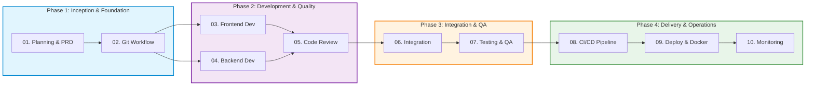

# 🤖 MyAgent — Modern SDLC & DevSecOps Knowledge Base

[ 🇮🇩 Bahasa Indonesia ](README.md) | [ 🇬🇧 English ](README.en.md)

---

[-blue.svg)](#-language-selection)

> **MyAgent** is a comprehensive repository of Standard Operating Procedures (SOPs), technical best practices, and structured skill modules designed for **AI Coding Assistants** (Cursor, Claude Code, GitHub Copilot, Codex) and **Software Engineering Teams** to execute end-to-end **DevSecOps-driven Software Development Life Cycle (SDLC)** across all major programming languages.

---

## 🌍 Polyglot Multi-Language Support

All skills are **Language-Agnostic** with idiomatic standards for industry-leading ecosystems:

| Ecosystem | Backend / UI Framework | Testing Suite | Linter & Formatter | Base Container Image |
|---|---|---|---|---|
| **TypeScript (Angular 17+ / React / Node)** | Angular 17+ (Signals), React, Next.js, Vue, NestJS | Vitest, Jest, Playwright | ESLint, Prettier, `@angular-eslint` | `node:20-alpine`, `nginx:alpine` (SPA) |
| **Python** | FastAPI, Django REST, Flask | PyTest, Unittest | Ruff, Black, MyPy | `python:3.12-slim` |
| **Golang** | Gin, Fiber, Echo, gRPC | `go test`, Testify | `golangci-lint`, `gofmt` | `golang:alpine` ➔ `scratch` (<20MB) |
| **Java / Kotlin** | Spring Boot, Micronaut, Quarkus | JUnit 5, Mockito | Spotless, Checkstyle | `eclipse-temurin:21-jre-alpine` |
| **PHP** | Laravel, Symfony | Pest, PHPUnit | PHPStan, PHP-CS-Fixer | `php:8.3-fpm-alpine` + Nginx |
| **C# / .NET 10** | ASP.NET Core 10 Minimal API / Web API (Native AOT) | xUnit, NUnit | Roslyn, `dotnet format` | `mcr.microsoft.com/dotnet/aspnet:10.0` |
| **Rust** | Actix-web, Axum, Tonic (gRPC) | `cargo test` | Clippy, `rustfmt` | `rust:alpine` ➔ `scratch` (<15MB) |

---

## 🗺️ End-to-End SDLC Workflow

Each skill is organized sequentially from initial project inception through post-release operational observability:

---

## 📚 10 SDLC Skill Modules Catalog

Each module contains strategic steps, command cheat sheets, common troubleshooting, naming conventions, Definition of Done (DoD) checklists, and ready-to-use config examples:

| # | Skill Module | Documentation (ID / EN) | Description & Key Scope | Ready Examples |
|:---:|:---|:---|:---|:---:|
| **01** | **Planning & PRD** | [ID](file:///c:/Users/galih.pranoto/Data/Galih/MyAgent/skills/01-planning/SKILL.md) \| [EN](file:///c:/Users/galih.pranoto/Data/Galih/MyAgent/skills/01-planning/SKILL.en.md) | Scope definition, PRD, User Stories, time estimation, security-by-design. | — |
| **02** | **Git Workflow** | [ID](file:///c:/Users/galih.pranoto/Data/Galih/MyAgent/skills/02-git-workflow/SKILL.md) \| [EN](file:///c:/Users/galih.pranoto/Data/Galih/MyAgent/skills/02-git-workflow/SKILL.en.md) | Git Flow / Trunk-based branching, Conventional Commits, PR workflow, Rich Annotated Tags. | [PR Template](file:///c:/Users/galih.pranoto/Data/Galih/MyAgent/skills/02-git-workflow/examples/pull-request-template.md) |
| **03** | **Frontend Development** | [ID](file:///c:/Users/galih.pranoto/Data/Galih/MyAgent/skills/03-frontend-development/SKILL.md) \| [EN](file:///c:/Users/galih.pranoto/Data/Galih/MyAgent/skills/03-frontend-development/SKILL.en.md) | Angular 17+ (Signals/Standalone), React, BroadcastChannel session control, WCAG 2.1 a11y, Microfrontend. | — |
| **04** | **Backend Development** | [ID](file:///c:/Users/galih.pranoto/Data/Galih/MyAgent/skills/04-backend-development/SKILL.md) \| [EN](file:///c:/Users/galih.pranoto/Data/Galih/MyAgent/skills/04-backend-development/SKILL.en.md) | Polyglot Microservices, .NET 10 LTS Native AOT, HTTP Security Headers, RFC 7807 Error, Redis Caching. | — |
| **05** | **Code Review & Standards** | [ID](file:///c:/Users/galih.pranoto/Data/Galih/MyAgent/skills/05-code-review-standards/SKILL.md) \| [EN](file:///c:/Users/galih.pranoto/Data/Galih/MyAgent/skills/05-code-review-standards/SKILL.en.md) | Review ethics, Clean Code (SOLID/DRY), Pre-commit hooks (Husky), Multi-language Linter gates. | [Linter Config](file:///c:/Users/galih.pranoto/Data/Galih/MyAgent/skills/05-code-review-standards/examples/linter-config-examples.js) |
| **06** | **Integration** | [ID](file:///c:/Users/galih.pranoto/Data/Galih/MyAgent/skills/06-integration/SKILL.md) \| [EN](file:///c:/Users/galih.pranoto/Data/Galih/MyAgent/skills/06-integration/SKILL.en.md) | API Gateway routing, Strict CORS, Correlation ID distributed tracing, internal mTLS, Contract testing. | — |
| **07** | **Testing & QA** | [ID](file:///c:/Users/galih.pranoto/Data/Galih/MyAgent/skills/07-testing/SKILL.md) \| [EN](file:///c:/Users/galih.pranoto/Data/Galih/MyAgent/skills/07-testing/SKILL.en.md) | SIT & UAT test matrix, Performance testing (k6), Security testing (OWASP ZAP), Automated regression. | — |
| **08** | **CI/CD Pipeline** | [ID](file:///c:/Users/galih.pranoto/Data/Galih/MyAgent/skills/08-cicd-pipeline/SKILL.md) \| [EN](file:///c:/Users/galih.pranoto/Data/Galih/MyAgent/skills/08-cicd-pipeline/SKILL.en.md) | Pipeline stages (Lint ➔ Test ➔ Scan ➔ Deploy), GitHub Actions / GitLab CI, Automated rollback. | [GitHub CI](file:///c:/Users/galih.pranoto/Data/Galih/MyAgent/skills/08-cicd-pipeline/examples/ci-build-test.yml) |
| **09** | **Deployment & Docker** | [ID](file:///c:/Users/galih.pranoto/Data/Galih/MyAgent/skills/09-deploy/SKILL.md) \| [EN](file:///c:/Users/galih.pranoto/Data/Galih/MyAgent/skills/09-deploy/SKILL.en.md) | Multi-stage Dockerfiles, Kubernetes manifests, Helm charts, Nginx Reverse Proxy, Let's Encrypt SSL/TLS. | [Dockerfile](file:///c:/Users/galih.pranoto/Data/Galih/MyAgent/skills/09-deploy/examples/Dockerfile.multistage.example) |
| **10** | **Monitoring & Observability** | [ID](file:///c:/Users/galih.pranoto/Data/Galih/MyAgent/skills/10-monitoring-observability/SKILL.md) \| [EN](file:///c:/Users/galih.pranoto/Data/Galih/MyAgent/skills/10-monitoring-observability/SKILL.en.md) | 3 Observability Pillars (Metrics, Logs, Traces), Prometheus/Grafana dashboards, Alerting, Incident SLA. | — |

---

## ⚙️ Quality Standards & Global Rules

All agents and engineers must adhere to the universal rules defined in [AGENTS.md](file:///c:/Users/galih.pranoto/Data/Galih/MyAgent/AGENTS.md):

### 🌐 Language Selection & Conventions
* **Document Language:** Technical documentation, PRDs, User Stories, Test Plans, analysis reports, and architecture design can be authored in **Bahasa Indonesia (Default)** or **English** based on team/stakeholder preference.
* **Document Consistency:** Ensure each individual document uses a single consistent language.
* **Technical Naming:** All code variables, functions, methods, classes, interfaces, filenames, API routes, and commit messages MUST remain in industry-standard **English**.

### 💻 Universal Clean Code
* Always enable **Strict Mode / Type Safety** across all languages (TypeScript strict mode, Python type hints, PHP `declare(strict_types=1)`, C# nullable reference types, Go/Java static typing).
* Follow the **Single Responsibility Principle (SRP)** — maximum function length is **50 lines**.
* Prefer **Immutable Values** by default (`const` in JS/TS, `readonly`/`record` in C#, `val` in Kotlin).

### 🔐 Security & DevSecOps
* **Zero Hardcoded Secrets:** Never hardcode credentials, API keys, or tokens in source code. Always use `.env` or centralized secret managers and ensure they are listed in `.gitignore`.
* Enforce **Least Privilege** across databases, API gateways, and container infrastructure.
* All data communication must be encrypted via **HTTPS/TLS 1.3**.

### 📊 Quality Gates
* Minimum **80% Code Coverage** on core business logic.
* Pass static code analysis with **SonarQube Rating A+** (0 Bugs, 0 Vulnerabilities, 0 Security Hotspots).
* Mandatory **Pull Request Code Review** before merging into the `main` branch.

---

## 🚀 Usage Guide

### 1. For AI Coding Assistants (Cursor, Claude Code, Copilot, Codex)
AI agents automatically match user prompts with the YAML frontmatter (`name` & `description`) of each skill:
* **Project Inception:** Refer to `01-planning/SKILL.md` (or `SKILL.en.md`).
* **Frontend Components:** Refer to `03-frontend-development/SKILL.md` (or `SKILL.en.md`).
* **Backend APIs & DB:** Refer to `04-backend-development/SKILL.md` (or `SKILL.en.md`).
* **Containerization & K8s:** Refer to `09-deploy/SKILL.md` (or `SKILL.en.md`).
* **CI/CD Automation:** Refer to `08-cicd-pipeline/SKILL.md` (or `SKILL.en.md`).

### 2. For Software Engineers
Use the `SKILL.md` files as a self-service quality checklist before submitting a Pull Request. Verify the **Definition of Done (DoD)** checklist items before requesting peer review.
