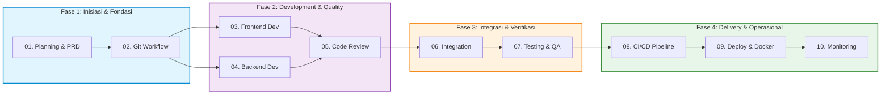

# 🤖 MyAgent — Knowledge Base & Panduan SDLC Modern

[](file:///c:/Users/galih.pranoto/Data/Galih/MyAgent/skills)
[](#-standar-kualitas--aturan-global)
[](#-keamanan--best-practices)
[](#-katalog-10-modul-skill-sdlc)
[](#-bahasa--konvensi)

> **MyAgent** adalah repositori standar operasional prosedur (*Standard Operating Procedures* / SOP), pedoman teknis (*best practices*), dan panduan skill terstruktur yang dirancang khusus untuk **AI Coding Assistant** (seperti Cursor, Claude Code, Copilot, Codex) dan **Tim Pengembang Perangkat Lunak** guna menjalankan seluruh siklus hidup pengembangan sistem (*Software Development Life Cycle* / SDLC) berbasis **DevSecOps**.

---

## 🗺️ Alur Kerja SDLC (End-to-End Workflow)

Setiap skill disusun secara berurutan dan terintegrasi dari tahap inisiasi proyek hingga pemantauan operasional pasca-rilis:



---

## 📚 Katalog 10 Modul Skill SDLC

Setiap modul dilengkapi dengan panduan strategis, cheat sheet perintah, panduan troubleshooting, konvensi penamaan, checklist *Definition of Done* (DoD), serta contoh file konfigurasi siap pakai:

| # | Modul Skill | Dokumen Panduan | Deskripsi & Cakupan Utama | Contoh Siap Pakai |
|:---:|:---|:---|:---|:---:|
| **01** | **Planning & PRD** | [SKILL.md](file:///c:/Users/galih.pranoto/Data/Galih/MyAgent/skills/01-planning/SKILL.md) | Ruang lingkup (Scoping), PRD, User Story, estimasi waktu, analisis keamanan awal. | — |
| **02** | **Git Workflow** | [SKILL.md](file:///c:/Users/galih.pranoto/Data/Galih/MyAgent/skills/02-git-workflow/SKILL.md) | Branching strategy (Git Flow/Trunk-based), Conventional Commits, PR workflow, SemVer. | [PR Template](file:///c:/Users/galih.pranoto/Data/Galih/MyAgent/skills/02-git-workflow/examples/pull-request-template.md) |
| **03** | **Frontend Development** | [SKILL.md](file:///c:/Users/galih.pranoto/Data/Galih/MyAgent/skills/03-frontend-development/SKILL.md) | Komponen modular, Single Session (BroadcastChannel), State Management, a11y (WCAG 2.1), Microfrontend. | — |
| **04** | **Backend Development** | [SKILL.md](file:///c:/Users/galih.pranoto/Data/Galih/MyAgent/skills/04-backend-development/SKILL.md) | Microservices, SonarQube A+, HTTP Security Headers, Anti-bot mitigation, RFC 7807 Error, Redis Caching. | — |
| **05** | **Code Review & Standards** | [SKILL.md](file:///c:/Users/galih.pranoto/Data/Galih/MyAgent/skills/05-code-review-standards/SKILL.md) | Etika review, Clean Code (SOLID/DRY/KISS), Pre-commit hooks, Linter & Formatter gates. | [Linter Config](file:///c:/Users/galih.pranoto/Data/Galih/MyAgent/skills/05-code-review-standards/examples/linter-config-examples.js) |
| **06** | **Integration** | [SKILL.md](file:///c:/Users/galih.pranoto/Data/Galih/MyAgent/skills/06-integration/SKILL.md) | API Gateway, CORS strict policy, Correlation ID Tracing, mTLS antar layanan, E2E contract test. | — |
| **07** | **Testing & QA** | [SKILL.md](file:///c:/Users/galih.pranoto/Data/Galih/MyAgent/skills/07-testing/SKILL.md) | SIT & UAT test matrix, Performance Testing (k6), Security Testing (OWASP ZAP), Automated regression. | — |
| **08** | **CI/CD Pipeline** | [SKILL.md](file:///c:/Users/galih.pranoto/Data/Galih/MyAgent/skills/08-cicd-pipeline/SKILL.md) | Pipeline stages (Lint → Test → Scan → Deploy), GitHub Actions/GitLab CI, Automated rollback. | [GitHub CI](file:///c:/Users/galih.pranoto/Data/Galih/MyAgent/skills/08-cicd-pipeline/examples/ci-build-test.yml) |
| **09** | **Deployment & Docker** | [SKILL.md](file:///c:/Users/galih.pranoto/Data/Galih/MyAgent/skills/09-deploy/SKILL.md) | Multi-stage Dockerfile, Kubernetes manifests, Helm charts, Reverse Proxy (Nginx), Let's Encrypt SSL. | [Dockerfile](file:///c:/Users/galih.pranoto/Data/Galih/MyAgent/skills/09-deploy/examples/Dockerfile.multistage.example) |
| **10** | **Monitoring & Observability** | [SKILL.md](file:///c:/Users/galih.pranoto/Data/Galih/MyAgent/skills/10-monitoring-observability/SKILL.md) | 3 Pilar Observabilitas (Metrics, Logs, Traces), Prometheus/Grafana, Alerting rules, Post-mortem. | — |

---

## ⚙️ Standar Kualitas & Aturan Global

Semua agen dan pengembang wajib mematuhi aturan universal yang terdefinisi pada [AGENTS.md](file:///c:/Users/galih.pranoto/Data/Galih/MyAgent/AGENTS.md):

### 🌐 Bahasa & Konvensi
* Gunakan **Bahasa Indonesia** sebagai bahasa utama untuk dokumentasi, komentar kode, dan penamaan variabel bisnis deskriptif.
* Gunakan **Bahasa Inggris** untuk penamaan teknis standar industri (variabel, fungsi, *class*, *file*, *endpoint* API).

### 💻 Standar Kode
* Selalu gunakan **Strict Mode** pada JavaScript/TypeScript.
* Terapkan sintaks **ES6+** (*arrow functions*, *destructuring*, *async/await*).
* Gunakan `const` secara *default*, gunakan `let` hanya jika nilai variabel perlu dimutasi. Dilarang menggunakan `var`.
* Terapkan **Single Responsibility Principle (SRP)** — batas panjang fungsi maksimal **50 baris**.

### 🔐 Keamanan & DevSecOps
* **Zero Hardcoded Secrets:** Dilarang menanam API key, kata sandi, atau token di kode sumber. Selalu gunakan file `.env` yang terdaftar pada `.gitignore`.
* Terapkan prinsip **Least Privilege** untuk database, API gateway, dan infrastruktur container.
* Seluruh komunikasi antar sistem wajib menggunakan protokol **HTTPS/TLS 1.3**.

### 📊 Standar Kualitas
* Target **Code Coverage minimal 80%** pada logika bisnis inti.
* Analisis statis wajib mencapai **SonarQube Rating A+** (0 Bugs, 0 Vulnerabilities, 0 Security Hotspots).
* Seluruh perubahan wajib melalui proses *Pull Request* dan *Code Review* sebelum digabungkan ke branch `main`.

---

## 📁 Struktur Repositori

```
MyAgent/
├── README.md                                        # Dokumentasi utama workspace
├── AGENTS.md                                        # Aturan global agen & developer
├── .gitattributes                                   # Standarisasi line ending (LF)
└── skills/
    ├── 01-planning/                                 # Fase 1: Planning & PRD
    │   └── SKILL.md
    ├── 02-git-workflow/                             # Fase 2: Version Control
    │   ├── SKILL.md
    │   └── examples/
    │       └── pull-request-template.md             # Template PR standar
    ├── 03-frontend-development/                     # Fase 3: Frontend Dev
    │   └── SKILL.md
    ├── 04-backend-development/                      # Fase 4: Backend Dev
    │   └── SKILL.md
    ├── 05-code-review-standards/                    # Fase 5: Code Review & Quality
    │   ├── SKILL.md
    │   └── examples/
    │       └── linter-config-examples.js            # Config ESLint, Prettier, Commitlint
    ├── 06-integration/                              # Fase 6: System Integration
    │   └── SKILL.md
    ├── 07-testing/                                  # Fase 7: Testing & QA
    │   └── SKILL.md
    ├── 08-cicd-pipeline/                            # Fase 8: CI/CD Pipeline
    │   ├── SKILL.md
    │   └── examples/
    │       └── ci-build-test.yml                    # GitHub Actions CI Workflow
    ├── 09-deploy/                                   # Fase 9: Deployment & K8s
    │   ├── SKILL.md
    │   └── examples/
    │       └── Dockerfile.multistage.example        # Multi-stage Dockerfile
    ├── 10-monitoring-observability/                 # Fase 10: Monitoring
    │   └── SKILL.md
    └── laporan-analisis-skills.md                   # Rekap analisis kualitas & histori
```

---

## 🚀 Panduan Penggunaan (Usage Guide)

### 1. Untuk AI Assistant (Cursor, Claude, Copilot, Codex)
Ketika menerima instruksi pengerjaan tugas, AI akan mencocokkan *prompt* pengguna dengan `name` dan `description` pada header YAML masing-masing `SKILL.md`:
* **Merencanakan Proyek Baru:** Baca `01-planning/SKILL.md`.
* **Membuat Komponen UI:** Baca `03-frontend-development/SKILL.md`.
* **Membangun API / Database:** Baca `04-backend-development/SKILL.md`.
* **Menyiapkan Deployment:** Baca `09-deploy/SKILL.md`.
* **Otomasi CI/CD:** Baca `08-cicd-pipeline/SKILL.md`.

### 2. Untuk Software Engineer
Gunakan dokumen `SKILL.md` sebagai *checklist* mandiri sebelum mengajukan *Pull Request*:
1. Pastikan fitur memenuhi **Langkah-Langkah Strategis** pada fase terkait.
2. Gunakan **⚡ Command Cheat Sheet** untuk perintah rutin (build, test, lint, scan).
3. Cek bagian **🛠️ Troubleshooting Umum** jika menemui kendala teknis.
4. Pastikan semua kotak centang pada **✅ Checklist & Definition of Done (DoD)** telah terpenuhi.

---

## 📑 Format Standar SKILL.md

Setiap file `SKILL.md` mengikuti struktur seragam dengan konsistensi 100%:

```markdown
---
name: <nama-skill-kebab-case>
description: <deskripsi ringkas untuk trigger-matching AI (~120-160 karakter)>
---

# Panduan Tahap: <Nama Tahap>

Pengantar tujuan dan ruang lingkup tahap...

## 1. Langkah-Langkah Strategis
...

## ⚡ Command Cheat Sheet
* `command` — Penjelasan singkat kegunaan.

## 🛠️ Troubleshooting Umum
* **Nama Isu:** Solusi penanganan masalah.

## 📐 Standar Penamaan (Naming Conventions)
* Konvensi penamaan file, fungsi, dan variabel.

---

## ✅ Checklist & Definition of Done (DoD)
* [ ] Kriteria penyelesaian tugas 1
* [ ] Kriteria penyelesaian tugas 2
```

---

## 📄 Lisensi & Kontribusi

* Repositori ini dikelola untuk standarisasi internal pengembangan perangkat lunak.
* Seluruh pembaruan skill dan template harus melalui proses peninjauan (*peer review*) dan audit pada [laporan-analisis-skills.md](file:///c:/Users/galih.pranoto/Data/Galih/MyAgent/skills/laporan-analisis-skills.md).
