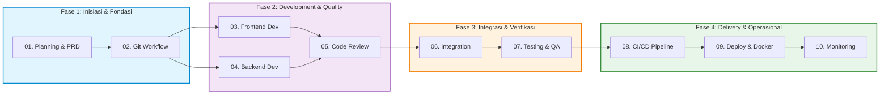

# 🤖 MyAgent — Knowledge Base & Panduan SDLC Modern

[ 🇮🇩 Bahasa Indonesia ](README.md) | [ 🇬🇧 English ](README.en.md) | [ 🇨🇳 简体中文 ](README.zh.md) | [ 🇸🇦 العربية ](README.ar.md)

---

[](#-dukungan-multi-bahasa-pemrograman-polyglot)
[](#-standar-kualitas--aturan-global)
[](#-keamanan--best-practices)
[](#-katalog-10-modul-skill-sdlc)
[-blue.svg)](#-bahasa--konvensi-language-selection)

> **MyAgent** adalah repositori standar operasional prosedur (*Standard Operating Procedures* / SOP), pedoman teknis (*best practices*), dan panduan skill terstruktur yang dirancang khusus untuk **AI Coding Assistant** (seperti Cursor, Claude Code, Copilot, Codex) dan **Tim Pengembang Perangkat Lunak** guna menjalankan seluruh siklus hidup pengembangan sistem (*Software Development Life Cycle* / SDLC) berbasis **DevSecOps** di **seluruh bahasa pemrograman**.

---

## 🌍 Dukungan Multi-Bahasa Pemrograman (Polyglot Ecosystem)

Koleksi skill ini dirancang bersifat **Language-Agnostic** dengan standar idiomatik untuk ekosistem populer:

| Ekosistem | Framework Backend / UI | Testing | Linter & Formatter | Base Container Image |
|---|---|---|---|---|
| **TypeScript (Angular 17+ / React / Node)** | Angular 17+ (Signals), React, Next.js, Vue, NestJS | Vitest, Jest, Playwright | ESLint, Prettier, `@angular-eslint` | `node:20-alpine`, `nginx:alpine` (SPA) |
| **Python** | FastAPI, Django REST, Flask | PyTest, Unittest | Ruff, Black, MyPy | `python:3.12-slim` |
| **Golang** | Gin, Fiber, Echo, gRPC | `go test`, Testify | `golangci-lint`, `gofmt` | `golang:alpine` ➔ `scratch` (<20MB) |
| **Java / Kotlin** | Spring Boot, Micronaut, Quarkus | JUnit 5, Mockito | Spotless, Checkstyle | `eclipse-temurin:21-jre-alpine` |
| **PHP** | Laravel, Symfony | Pest, PHPUnit | PHPStan, PHP-CS-Fixer | `php:8.3-fpm-alpine` + Nginx |
| **C# / .NET 10** | ASP.NET Core 10 Minimal API / Web API (Native AOT) | xUnit, NUnit | Roslyn, `dotnet format` | `mcr.microsoft.com/dotnet/aspnet:10.0` |
| **Rust** | Actix-web, Axum, Tonic (gRPC) | `cargo test` | Clippy, `rustfmt` | `rust:alpine` ➔ `scratch` (<15MB) |

---

## 🗺️ Alur Kerja SDLC (End-to-End Workflow)

Setiap skill disusun secara berurutan dan terintegrasi dari tahap inisiasi proyek hingga pemantauan operasional pasca-rilis:



---

## 📚 Katalog 10 Modul Skill SDLC

Setiap modul dilengkapi dengan panduan strategis, cheat sheet perintah, panduan troubleshooting, konvensi penamaan, checklist *Definition of Done* (DoD), serta contoh file konfigurasi siap pakai:

| # | Modul Skill | Panduan Lengkap (4 Bahasa) | Deskripsi & Cakupan Utama | Contoh Siap Pakai |
|:---:|:---|:---|:---|:---:|
| **01** | **Planning & PRD** | [ID](skills/01-planning/SKILL.md) \| [EN](skills/01-planning/SKILL.en.md) \| [ZH](skills/01-planning/SKILL.zh.md) \| [AR](skills/01-planning/SKILL.ar.md) | Ruang lingkup (Scoping), PRD, User Story, estimasi waktu, analisis keamanan awal. | — |
| **02** | **Git Workflow** | [ID](skills/02-git-workflow/SKILL.md) \| [EN](skills/02-git-workflow/SKILL.en.md) \| [ZH](skills/02-git-workflow/SKILL.zh.md) \| [AR](skills/02-git-workflow/SKILL.ar.md) | Branching strategy (Git Flow/Trunk-based), Conventional Commits, PR workflow, Rich Tags. | [PR Template](skills/02-git-workflow/examples/pull-request-template.md) |
| **03** | **Frontend Development** | [ID](skills/03-frontend-development/SKILL.md) \| [EN](skills/03-frontend-development/SKILL.en.md) \| [ZH](skills/03-frontend-development/SKILL.zh.md) \| [AR](skills/03-frontend-development/SKILL.ar.md) | Desain Responsif (Mobile-First RWD), Angular 17+ (Signals), React, 4 Bahasa UI (RTL Arab), Sesi 1 Tab. | — |
| **04** | **Backend Development** | [ID](skills/04-backend-development/SKILL.md) \| [EN](skills/04-backend-development/SKILL.en.md) \| [ZH](skills/04-backend-development/SKILL.zh.md) \| [AR](skills/04-backend-development/SKILL.ar.md) | Microservices polyglot, .NET 10 LTS Native AOT, HTTP Security Headers, RFC 7807 Error, Caching. | — |
| **05** | **Code Review & Standards** | [ID](skills/05-code-review-standards/SKILL.md) \| [EN](skills/05-code-review-standards/SKILL.en.md) \| [ZH](skills/05-code-review-standards/SKILL.zh.md) \| [AR](skills/05-code-review-standards/SKILL.ar.md) | Etika review, Clean Code (SOLID/DRY), Pre-commit hooks, Linter multi-bahasa. | [Linter Config](skills/05-code-review-standards/examples/linter-config-examples.js) |
| **06** | **Integration** | [ID](skills/06-integration/SKILL.md) \| [EN](skills/06-integration/SKILL.en.md) \| [ZH](skills/06-integration/SKILL.zh.md) \| [AR](skills/06-integration/SKILL.ar.md) | API Gateway, CORS strict, Correlation ID Tracing, mTLS internal, E2E contract test. | — |
| **07** | **Testing & QA** | [ID](skills/07-testing/SKILL.md) \| [EN](skills/07-testing/SKILL.en.md) \| [ZH](skills/07-testing/SKILL.zh.md) \| [AR](skills/07-testing/SKILL.ar.md) | SIT & UAT matrix, Performance Testing (k6), Security Testing (OWASP ZAP), Automated regression. | — |
| **08** | **CI/CD Pipeline** | [ID](skills/08-cicd-pipeline/SKILL.md) \| [EN](skills/08-cicd-pipeline/SKILL.en.md) \| [ZH](skills/08-cicd-pipeline/SKILL.zh.md) \| [AR](skills/08-cicd-pipeline/SKILL.ar.md) | Pipeline stages (Lint ➔ Test ➔ Scan ➔ Deploy), GitHub Actions / GitLab CI, Auto-rollback. | [GitHub CI](skills/08-cicd-pipeline/examples/ci-build-test.yml) |
| **09** | **Deployment & Docker** | [ID](skills/09-deploy/SKILL.md) \| [EN](skills/09-deploy/SKILL.en.md) \| [ZH](skills/09-deploy/SKILL.zh.md) \| [AR](skills/09-deploy/SKILL.ar.md) | Multi-stage Dockerfiles, Kubernetes manifests, Helm, Nginx Reverse Proxy, Let's Encrypt. | [Dockerfile](skills/09-deploy/examples/Dockerfile.multistage.example) |
| **10** | **Monitoring & Observability** | [ID](skills/10-monitoring-observability/SKILL.md) \| [EN](skills/10-monitoring-observability/SKILL.en.md) \| [ZH](skills/10-monitoring-observability/SKILL.zh.md) \| [AR](skills/10-monitoring-observability/SKILL.ar.md) | 3 Pilar Observabilitas (Metrics, Logs, Traces), Prometheus/Grafana, Alerting rules, Post-mortem. | — |

---

## ⚙️ Standar Kualitas & Aturan Global

Semua agen dan pengembang wajib mematuhi aturan universal yang terdefinisi pada [AGENTS.md](file:///c:/Users/galih.pranoto/Data/Galih/MyAgent/AGENTS.md):

### 🌐 Bahasa & Konvensi (Language Selection)
* **Pilihan Bahasa Dokumen:** Dokumen teknis, PRD, *User Story*, *Test Plan*, laporan analisis, dan arsitektur dapat disusun dalam **Bahasa Indonesia (Default)** atau **Bahasa Inggris (English)** sesuai preferensi tim/klien.
* **Bahasa Penamaan Teknis:** Seluruh penamaan variabel, fungsi, *method*, *class*, *interface*, *file*, *endpoint* API, dan commit messages wajib tetap menggunakan **Bahasa Inggris** standar industri.

### 💻 Standar Kode
* Selalu gunakan **Strict Mode** pada JavaScript/TypeScript.
* Terapkan sintaks **ES6+** (*arrow functions*, *destructuring*, *async/await*).
* Gunakan `const` secara *default*, gunakan `let` hanya jika nilai variabel perlu dimutasi. Dilarang menggunakan `var`.
* Terapkan **Single Responsibility Principle (SRP)** — batas panjang fungsi maksimal **50 baris**.

### 🔐 Keamanan & DevSecOps
* **Zero Hardcoded Secrets:** Dilarang menanam API key, kata sandi, atau token di kode sumber. Selalu gunakan file `.env` yang terdaftar pada `.gitignore`.
* Terapkan prinsip **Least Privilege** untuk database, API gateway, dan infrastruktur container.
* Seluruh komunikasi antar sistem wajib menggunakan protokol **HTTPS/TLS 1.3**.

### 📊 Standar Kualitas
* Target **Code Coverage minimal 80%** pada logika bisnis inti.
* Analisis statis wajib mencapai **SonarQube Rating A+** (0 Bugs, 0 Vulnerabilities, 0 Security Hotspots).
* Seluruh perubahan wajib melalui proses *Pull Request* dan *Code Review* sebelum digabungkan ke branch `main`.

---

## 📁 Struktur Repositori

```
MyAgent/
├── README.md                                        # Dokumentasi utama workspace
├── AGENTS.md                                        # Aturan global agen & developer
├── .gitattributes                                   # Standarisasi line ending (LF)
└── skills/
    ├── 01-planning/                                 # Fase 1: Planning & PRD
    │   └── SKILL.md
    ├── 02-git-workflow/                             # Fase 2: Version Control
    │   ├── SKILL.md
    │   └── examples/
    │       └── pull-request-template.md             # Template PR standar
    ├── 03-frontend-development/                     # Fase 3: Frontend Dev
    │   └── SKILL.md
    ├── 04-backend-development/                      # Fase 4: Backend Dev
    │   └── SKILL.md
    ├── 05-code-review-standards/                    # Fase 5: Code Review & Quality
    │   ├── SKILL.md
    │   └── examples/
    │       └── linter-config-examples.js            # Config ESLint, Prettier, Commitlint
    ├── 06-integration/                              # Fase 6: System Integration
    │   └── SKILL.md
    ├── 07-testing/                                  # Fase 7: Testing & QA
    │   └── SKILL.md
    ├── 08-cicd-pipeline/                            # Fase 8: CI/CD Pipeline
    │   ├── SKILL.md
    │   └── examples/
    │       └── ci-build-test.yml                    # GitHub Actions CI Workflow
    ├── 09-deploy/                                   # Fase 9: Deployment & K8s
    │   ├── SKILL.md
    │   └── examples/
    │       └── Dockerfile.multistage.example        # Multi-stage Dockerfile
    ├── 10-monitoring-observability/                 # Fase 10: Monitoring
    │   └── SKILL.md
    └── laporan-analisis-skills.md                   # Rekap analisis kualitas & histori
```

---

## 🚀 Panduan Penggunaan (Usage Guide)

### 1. Untuk AI Assistant (Cursor, Claude, Copilot, Codex)
Ketika menerima instruksi pengerjaan tugas, AI akan mencocokkan *prompt* pengguna dengan `name` dan `description` pada header YAML masing-masing `SKILL.md`:
* **Merencanakan Proyek Baru:** Baca `01-planning/SKILL.md`.
* **Membuat Komponen UI:** Baca `03-frontend-development/SKILL.md`.
* **Membangun API / Database:** Baca `04-backend-development/SKILL.md`.
* **Menyiapkan Deployment:** Baca `09-deploy/SKILL.md`.
* **Otomasi CI/CD:** Baca `08-cicd-pipeline/SKILL.md`.

### 2. Untuk Software Engineer
Gunakan dokumen `SKILL.md` sebagai *checklist* mandiri sebelum mengajukan *Pull Request*:
1. Pastikan fitur memenuhi **Langkah-Langkah Strategis** pada fase terkait.
2. Gunakan **⚡ Command Cheat Sheet** untuk perintah rutin (build, test, lint, scan).
3. Cek bagian **🛠️ Troubleshooting Umum** jika menemui kendala teknis.
4. Pastikan semua kotak centang pada **✅ Checklist & Definition of Done (DoD)** telah terpenuhi.

---

## 📑 Format Standar SKILL.md

Setiap file `SKILL.md` mengikuti struktur seragam dengan konsistensi 100%:

```markdown
---
name: <nama-skill-kebab-case>
description: <deskripsi ringkas untuk trigger-matching AI (~120-160 karakter)>
---

# Panduan Tahap: <Nama Tahap>

Pengantar tujuan dan ruang lingkup tahap...

## 1. Langkah-Langkah Strategis
...

## ⚡ Command Cheat Sheet
* `command` — Penjelasan singkat kegunaan.

## 🛠️ Troubleshooting Umum
* **Nama Isu:** Solusi penanganan masalah.

## 📐 Standar Penamaan (Naming Conventions)
* Konvensi penamaan file, fungsi, dan variabel.

---

## ✅ Checklist & Definition of Done (DoD)
* [ ] Kriteria penyelesaian tugas 1
* [ ] Kriteria penyelesaian tugas 2
```

---

## 📄 Lisensi & Kontribusi

* Repositori ini dikelola untuk standarisasi internal pengembangan perangkat lunak.
* Seluruh pembaruan skill dan template harus melalui proses peninjauan (*peer review*) dan audit pada [laporan-analisis-skills.md](file:///c:/Users/galih.pranoto/Data/Galih/MyAgent/skills/laporan-analisis-skills.md).
