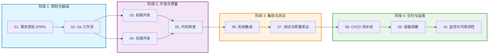

# 🤖 MyAgent — 现代软件生命周期 (SDLC) 与 DevSecOps 知识库

[ 🇮🇩 Bahasa Indonesia ](README.md) | [ 🇬🇧 English ](README.en.md) | [ 🇨🇳 简体中文 ](README.zh.md) | [ 🇸🇦 العربية ](README.ar.md)

---

[-blue.svg)](#-文档与界面多语言标准)

> **MyAgent** 是一套标准作业程序（SOP）、技术最佳实践和结构化技能模块库，专为 **AI 编程助手**（Cursor、Claude Code、GitHub Copilot、Codex）及 **软件工程团队** 设计，用于跨所有主流编程语言执行端到端 **基于 DevSecOps 的软件开发生命周期 (SDLC)**。

---

## 🌍 多语言支持 (Polyglot)

所有技能模块均为 **语言无关 (Language-Agnostic)**，并针对主流技术生态制定了标准：

| 技术生态 | 后端 / UI 框架 | 测试套件 | 代码检查与格式化 | 基础容器镜像 |
|---|---|---|---|---|
| **TypeScript (Angular 17+ / React / Node)** | Angular 17+ (Signals), React, Next.js, Vue, NestJS | Vitest, Jest, Playwright | ESLint, Prettier, `@angular-eslint` | `node:20-alpine`, `nginx:alpine` (SPA) |
| **Python** | FastAPI, Django REST, Flask | PyTest, Unittest | Ruff, Black, MyPy | `python:3.12-slim` |
| **Golang** | Gin, Fiber, Echo, gRPC | `go test`, Testify | `golangci-lint`, `gofmt` | `golang:alpine` ➔ `scratch` (<20MB) |
| **Java / Kotlin** | Spring Boot, Micronaut, Quarkus | JUnit 5, Mockito | Spotless, Checkstyle | `eclipse-temurin:21-jre-alpine` |
| **PHP** | Laravel, Symfony | Pest, PHPUnit | PHPStan, PHP-CS-Fixer | `php:8.3-fpm-alpine` + Nginx |
| **C# / .NET 10** | ASP.NET Core 10 Minimal API / Web API (Native AOT) | xUnit, NUnit | Roslyn, `dotnet format` | `mcr.microsoft.com/dotnet/aspnet:10.0` |
| **Rust** | Actix-web, Axum, Tonic (gRPC) | `cargo test` | Clippy, `rustfmt` | `rust:alpine` ➔ `scratch` (<15MB) |

---

## 🗺️ 端到端 SDLC 开发流程

技能模块按照软件工程顺序分为 4 个主要阶段：

---

## 📚 10 个 SDLC 技能模块目录

每个模块均包含操作策略、命令速查表、故障排查、命名规范、完成定义 (DoD) 清单以及即开即用的示例配置：

| # | 技能模块 | 技能指南 (4 种语言) | 核心范围与描述 | 现成示例 |
|:---:|:---|:---|:---|:---:|
| **01** | **需求规划 (PRD)** | [ID](skills/01-planning/SKILL.md) \| [EN](skills/01-planning/SKILL.en.md) \| [ZH](skills/01-planning/SKILL.zh.md) \| [AR](skills/01-planning/SKILL.ar.md) | 范围界定 (Scoping)、PRD、用户故事、工期估算、设计初期的安全防护。 | — |
| **02** | **Git 工作流** | [ID](skills/02-git-workflow/SKILL.md) \| [EN](skills/02-git-workflow/SKILL.en.md) \| [ZH](skills/02-git-workflow/SKILL.zh.md) \| [AR](skills/02-git-workflow/SKILL.ar.md) | 分支策略 (Git Flow / Trunk-based)、约定式提交、PR 流程、语义化版本与丰富标签。 | [PR 模板](skills/02-git-workflow/examples/pull-request-template.md) |
| **03** | **前端开发** | [ID](skills/03-frontend-development/SKILL.md) \| [EN](skills/03-frontend-development/SKILL.en.md) \| [ZH](skills/03-frontend-development/SKILL.zh.md) \| [AR](skills/03-frontend-development/SKILL.ar.md) | 响应式设计 (Mobile-First RWD)、Angular 17+ (Signals)、React、4 语言界面 (阿拉伯 RTL)、单会话控制。 | — |
| **04** | **后端开发** | [ID](skills/04-backend-development/SKILL.md) \| [EN](skills/04-backend-development/SKILL.en.md) \| [ZH](skills/04-backend-development/SKILL.zh.md) \| [AR](skills/04-backend-development/SKILL.ar.md) | 多语言微服务、.NET 10 LTS Native AOT、HTTP 安全标头、RFC 7807 错误规范、Redis 缓存。 | — |
| **05** | **代码审查与标准** | [ID](skills/05-code-review-standards/SKILL.md) \| [EN](skills/05-code-review-standards/SKILL.en.md) \| [ZH](skills/05-code-review-standards/SKILL.zh.md) \| [AR](skills/05-code-review-standards/SKILL.ar.md) | 审查礼仪、整洁代码 (SOLID/DRY)、Pre-commit 钩子 (Husky)、多语言代码检查门禁。 | [Linter 配置](skills/05-code-review-standards/examples/linter-config-examples.js) |
| **06** | **系统集成** | [ID](skills/06-integration/SKILL.md) \| [EN](skills/06-integration/SKILL.en.md) \| [ZH](skills/06-integration/SKILL.zh.md) \| [AR](skills/06-integration/SKILL.ar.md) | API 网关路由、严格 CORS、Correlation ID 链路追踪、内部 mTLS 加密、端到端契约测试。 | — |
| **07** | **测试与质量保证** | [ID](skills/07-testing/SKILL.md) \| [EN](skills/07-testing/SKILL.en.md) \| [ZH](skills/07-testing/SKILL.zh.md) \| [AR](skills/07-testing/SKILL.ar.md) | SIT 与 UAT 测试矩阵、k6 性能压测、OWASP ZAP 安全扫描、自动化回归测试。 | — |
| **08** | **CI/CD 流水线** | [ID](skills/08-cicd-pipeline/SKILL.md) \| [EN](skills/08-cicd-pipeline/SKILL.en.md) \| [ZH](skills/08-cicd-pipeline/SKILL.zh.md) \| [AR](skills/08-cicd-pipeline/SKILL.ar.md) | 流水线阶段 (Lint ➔ Test ➔ Scan ➔ Deploy)、GitHub Actions / GitLab CI、自动回滚。 | [GitHub CI](skills/08-cicd-pipeline/examples/ci-build-test.yml) |
| **09** | **容器部署与 Docker** | [ID](skills/09-deploy/SKILL.md) \| [EN](skills/09-deploy/SKILL.en.md) \| [ZH](skills/09-deploy/SKILL.zh.md) \| [AR](skills/09-deploy/SKILL.ar.md) | 多阶段 Dockerfile、Kubernetes 清单、Helm 部署、Nginx 反向代理、Let's Encrypt SSL。 | [Dockerfile](skills/09-deploy/examples/Dockerfile.multistage.example) |
| **10** | **监控与可观测性** | [ID](skills/10-monitoring-observability/SKILL.md) \| [EN](skills/10-monitoring-observability/SKILL.en.md) \| [ZH](skills/10-monitoring-observability/SKILL.zh.md) \| [AR](skills/10-monitoring-observability/SKILL.ar.md) | 3 大可观测性支柱 (Metrics, Logs, Traces)、Prometheus/Grafana 仪表盘、告警策略。 | — |

---

## ⚙️ 全局质量标准与规则

所有工程师与 AI Agent 均须遵守 [AGENTS.md](AGENTS.md) 中定义的通用规则：

### 🌐 文档与界面多语言标准 (i18n & RTL)
* **文档语言选择:** 技术文档、PRD、测试计划与架构设计可根据团队需求选用 **印尼语 (Bahasa Indonesia)** 或 **英语 (English)** 编写。
* **应用界面 4 种语言支持:** 前端界面原生支持 4 种主要语言实时切换：
  * 🇮🇩 **印尼语 (ID):** `src/assets/i18n/id.json` (从左到右 LTR)
  * 🇬🇧 **英语 (EN):** `src/assets/i18n/en.json` (从左到右 LTR)
  * 🇨🇳 **中文 / 简体中文 (ZH):** `src/assets/i18n/zh.json` (从左到右 LTR)
  * 🇸🇦 **阿拉伯语 (AR):** `src/assets/i18n/ar.json` (从右到左 **RTL / Right-to-Left**)
* **文本与代码分离准则:** 仅用户界面的显示文本与标签支持多语言。所有代码变量名、函数名、类名、接口名、文件路径、API 路由及 JSON 键名 (`"AUTH.LOGIN_TITLE"`) **必须 100% 保持标准英文编程规范**。

### 💻 通用整洁代码规范
* 始终在所有支持的语言中开启 **严格类型检查 (Strict Mode / Type Safety)**。
* 遵循 **单一职责原则 (SRP)** — 单个函数最大长度限制为 **50 行**。
* 默认采用 **不可变值 (Immutability First)**（JS/TS 中的 `const`，C# 中的 `readonly`/`record`）。

### 🔐 安全与 DevSecOps
* **零硬编码密钥:** 严禁在源代码中硬编码任何 API 密钥、密码或 Token。统一使用 `.env` 并加入 `.gitignore`。
* 在数据库、API 网关及容器架构中贯彻 **最小权限原则 (Least Privilege)**。
* 所有数据传输必须使用 **HTTPS / TLS 1.3** 加密协议。

### 📊 质量门禁
* 核心业务逻辑的单元测试覆盖率不低于 **80%**。
* 静态代码分析必须达到 **SonarQube A+ 评级**（0 Bugs, 0 漏洞, 0 安全热点）。
* 所有代码更改必须通过 **Pull Request 代码审查** 后方可合并至 `main` 主分支。

---

## 🚀 使用指南

### 1. 适用于 AI 编程助手 (Cursor, Claude Code, Copilot, Codex)
AI 助手会根据各技能模块中的 YAML Frontmatter 描述自动匹配用户提示：
* **立项规划:** 查阅 `01-planning/SKILL.md` (或 `SKILL.en.md`)。
* **前端开发:** 查阅 `03-frontend-development/SKILL.md` (或 `SKILL.en.md`)。
* **后端 API:** 查阅 `04-backend-development/SKILL.md` (或 `SKILL.en.md`)。
* **容器化部署:** 查阅 `09-deploy/SKILL.md` (或 `SKILL.en.md`)。
* **CI/CD 流水线:** 查阅 `08-cicd-pipeline/SKILL.md` (或 `SKILL.en.md`)。

### 2. 适用于软件工程师团队
可将各模块中的 `SKILL.md` 作为提交 PR 前的自检清单，对照 **Definition of Done (DoD)** 逐项核验以确保高质量交付。
