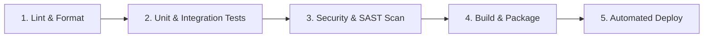

[ 🇮🇩 Bahasa Indonesia ](SKILL.md) | [ 🇬🇧 English ](SKILL.en.md) | [ 🇨🇳 简体中文 ](SKILL.zh.md) | [ 🇸🇦 العربية ](SKILL.ar.md)

---

# Phase Guide: CI/CD Pipeline & Automated Deployment

This phase focuses on automating the software delivery lifecycle — from code push, linting, unit testing, vulnerability scanning, and Docker packaging to automated deployment across environments.

## 1. Core CI/CD Principles

*   **Fail-Fast:** Place the fastest checks first (Lint ➔ Unit Tests ➔ Security Scan ➔ Build ➔ Deploy) so pipeline failures provide immediate feedback.
*   **Dependency Caching:** Cache package managers (`npm`, `pip`, `go`, `gradle`, `nuget`, `cargo`) to reduce pipeline execution time by up to 70%.
*   **Environment Promotion:** Enforce a linear deployment progression: `Local ➔ Staging / Testing ➔ Production`.

---

## 2. Standard CI/CD Stages

1. **Lint & Code Analysis:** Verify syntax and style rules.
2. **Automated Testing & Coverage:** Run test suite; fail if coverage < 80%.
3. **Security Scanning (SAST / Dependency Scan):** Scan with Snyk, Trivy, or `npm audit` / `dotnet list package --vulnerable`.
4. **Build & Containerization:** Compile binaries and build multi-stage Docker images.
5. **Deployment:** Deploy to Kubernetes, cloud servers, or PaaS with health checks.

---

## 3. Rollback & Deployment Strategies

*   **Blue-Green Deployment:** Run old (Blue) and new (Green) environments simultaneously; switch traffic instantly via reverse proxy.
*   **Canary Deployment:** Route 5-10% of traffic to the new release; scale up upon validating error rate stability.
*   **Automated Rollback:** Trigger instant rollback if post-deploy health checks fail.

---

## ⚡ Command Cheat Sheet
*   `act` — Test GitHub Actions workflows locally using Docker.
*   `gh workflow run ci.yml` — Manually trigger a GitHub Actions workflow.
*   `gh run list` — View status of recent CI runs.

## 🛠️ Common Troubleshooting
*   **Cache Invalidation:** Force cache eviction by changing the cache key prefix in the workflow file.
*   **Secret Access Denied:** Ensure repository secrets (`DOCKER_PASSWORD`, `SSH_KEY`) are properly configured in repository settings.

## 📐 Naming Conventions
*   **Workflow Files:** *kebab-case* YAML files in `.github/workflows/` (e.g., `ci-build-test.yml`, `cd-production.yml`).

---

## ✅ Checklist & Definition of Done (DoD)

*   [ ] CI pipeline automatically triggers on push and pull requests to `main` and `development`.
*   [ ] Pipeline incorporates Lint ➔ Test ➔ Scan ➔ Build stages.
*   [ ] Quality gates enforce minimum 80% test coverage and SonarQube Rating A+.
*   [ ] Container security scanning (Trivy) is integrated into the build stage.
*   [ ] Automated rollback mechanism is verified.
