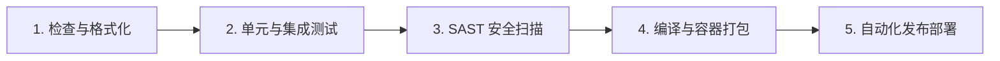

[ 🇮🇩 Bahasa Indonesia ](SKILL.md) | [ 🇬🇧 English ](SKILL.en.md) | [ 🇨🇳 简体中文 ](SKILL.zh.md) | [ 🇸🇦 العربية ](SKILL.ar.md)

---

# 阶段指南: CI/CD 流水线与自动化部署

本阶段专注于软件交付全生命周期的自动化 — 从代码提交、静态检查、单元测试、漏洞扫描、Docker 镜像打包到多环境自动化部署。

## 1. CI/CD 核心设计原则

*   **快速失败 (Fail-Fast):** 耗时最短的检查置于前置阶段（Lint ➔ 单元测试 ➔ 安全扫描 ➔ 编译构建 ➔ 部署），失败时立即中断并提供反馈。
*   **依赖缓存:** 对包管理器依赖进行缓存，缩短流水线执行时间达 70%。
*   **环境晋级:** 严格遵循流水线升级路径：`本地 ➔ 测试/预发 (Staging) ➔ 生产环境 (Production)`。

---

## 2. 标准 CI/CD 流水线阶段

---

## 3. 部署与回滚策略

*   **蓝绿部署 (Blue-Green):** 新旧两套环境并行，通过反向代理实现零停机秒级切换。
*   **金丝雀发布 (Canary):** 先引入 5-10% 流量验证稳定性后再全量上线。
*   **自动回滚:** 部署后健康检查探测失败时自动触发版本回退。

---

## ⚡ 常用命令速查
*   `act` — 在本地 Docker 环境中模拟运行 GitHub Actions 工作流。
*   `gh workflow run ci.yml` — 手动触发 GitHub Actions 流水线。

---

## ✅ 检查清单与完成定义 (DoD)

*   [ ] CI 流水线已配置在 `main` 与 `development` 分支提交时自动触发。
*   [ ] 流水线包含完整阶段 (Lint ➔ Test ➔ Scan ➔ Build)。
*   [ ] 质量门禁强制要求测试覆盖率 ≥ 80% 且 SonarQube 达标。
*   [ ] 容器安全扫描 (Trivy) 已整合至构建阶段。
*   [ ] 自动化回滚机制已通过验证。
