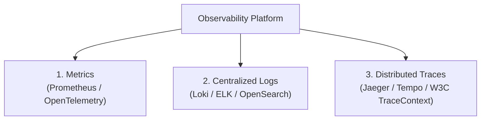

[ 🇮🇩 Bahasa Indonesia ](SKILL.md) | [ 🇬🇧 English ](SKILL.en.md)

---

# Phase Guide: Monitoring, Observability & Incident Management

This phase focuses on production monitoring, real-time observability, and incident response readiness for live applications — ensuring system resilience, performance stability, and proactive anomaly detection.

## 1. The Three Pillars of Observability

1. **Metrics:** Real-time numerical data measuring CPU, memory, request rates, error rates, and latency (RED method: Rate, Errors, Duration).
2. **Centralized Logs:** Structured JSON logs tagged with Correlation IDs for fast root-cause analysis across microservices.
3. **Distributed Traces:** End-to-end request timeline tracing from frontend through API gateways and microservices to database queries.

---

## 2. Metrics & Health Checks (Prometheus & OpenTelemetry)

*   **Standard Health Endpoints:**
    *   `/health/live` (*Liveness*): Confirms application process is alive.
    *   `/health/ready` (*Readiness*): Confirms DB connections and cache dependencies are ready to accept traffic.
*   **Prometheus Exporter (`/metrics`):** Expose Prometheus-compatible metrics (HTTP duration histograms, active connections, error counters).

---

## 3. Visual Dashboards & Alerting (Grafana & Alertmanager)

*   **Grafana Dashboards:** Visualize system health, HTTP throughput, P95/P99 latency, and container resource utilization.
*   **Alert Routing:** Dispatch high-priority notifications to Slack, Telegram, PagerDuty, or email with actionable runbook links.

---

## 4. Incident Response & Post-Mortem Workflow

1. **Detection & Triage:** Identify anomalies via alerts and assess severity (P1 Critical to P4 Low).
2. **Mitigation First:** Restore service availability immediately via rollback or traffic rerouting before debugging deep root causes.
3. **Blameless Post-Mortem:** Document root-cause analysis (5 Whys), timeline of events, and preventative action items within 48 hours.

---

## ⚡ Command Cheat Sheet
*   `curl -s http://localhost:3000/metrics` — View exposed Prometheus application metrics.
*   `kubectl top pods` — Check real-time CPU and memory usage of Kubernetes pods.
*   `promtool check rules alerts.yml` — Validate Prometheus alerting rules syntax.

## 🛠️ Common Troubleshooting
*   **High Memory / Memory Leak:** Analyze heap dumps, inspect unclosed database connections, or tune garbage collection parameters.
*   **Alert Fatigue:** Consolidate redundant alerts, tune false-positive thresholds, and set minimum duration triggers (`for: 5m`).

## 📐 Naming Conventions
*   **Prometheus Metrics:** Standard *snake_case* with units (e.g., `http_requests_total`, `http_request_duration_seconds`).
*   **Alert Rules:** Descriptive *PascalCase* (e.g., `HighErrorRateAlert`, `ServiceDownAlert`).

---

## ✅ Checklist & Definition of Done (DoD)

*   [ ] Standard health check endpoints (`/health/live`, `/health/ready`) are active.
*   [ ] Prometheus metrics and OpenTelemetry tracing are integrated.
*   [ ] Centralized JSON logging with Correlation IDs is streaming to log collectors.
*   [ ] Production Grafana dashboards and critical alerting rules are active.
*   [ ] Blameless post-mortem template is ready for incident management.
